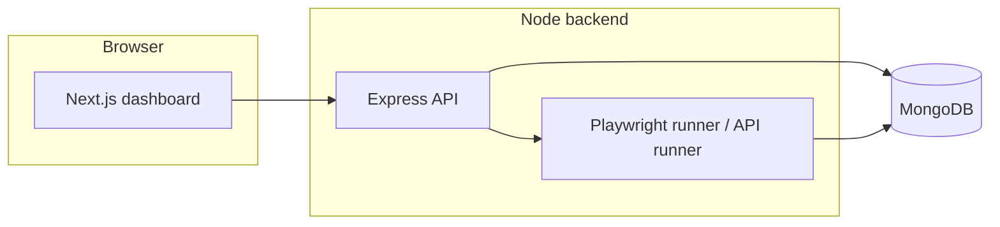

# AutoTestIQ

Full-stack **test automation** workspace: create and run **UI** tests (Playwright with self-healing locators) and **API** tests from a **Next.js** dashboard, persist **executions** in **MongoDB**, and optionally hook **Slack** and **AI** analysis.

---

## Demo

The best way to understand the product is a short walkthrough video.

**[Watch the demo →](YOUR_VIDEO_URL_HERE)**  
*Replace `YOUR_VIDEO_URL_HERE` with your YouTube or Loom link after you publish.*

Tip: On GitHub you can later swap that line for a thumbnail link, for example:

```markdown
[](https://www.youtube.com/watch?v=YOUR_VIDEO_ID)
```

---

## Highlights

- **No-code UI tests** — Steps for fill, click, and text assertions; Playwright drives a real browser.
- **Self-healing locators** — When a strict label match fails, the runner tries button, link, placeholder, text, and fuzzy strategies and records what worked.
- **API test runs** — Chained requests with variable extraction and assertions, stored alongside UI executions.
- **Execution history** — Per-run step table, status, errors, and optional screenshot paths for failed UI steps.
- **Role-based access** — JWT auth; dashboard flows for admin / tester / viewer (as configured in your app).
- **Optional integrations** — Slack notifications and slash commands; Groq-powered execution analysis and API-flow generation (when API keys are set).

---

## Tech stack

| Layer        | Technologies                          |
| ------------ | ------------------------------------- |
| Frontend     | Next.js 15, React 19, TypeScript, Tailwind CSS |
| Backend      | Node.js, Express 5, Mongoose          |
| Automation   | Playwright                            |
| Data         | MongoDB                               |
| Validation   | Zod                                   |

---

## Architecture



---

## Prerequisites

- **Node.js** 18+ recommended  
- **MongoDB** (local or [Atlas](https://www.mongodb.com/cloud/atlas))  
- **Playwright browsers** (install once after backend deps — see Quick start)

---

## Quick start

### 1. Clone and install

```bash
git clone https://github.com/YOUR_USERNAME/Automation-Testing.git
cd Automation-Testing
```

**Backend**

```bash
cd backend
npm install
npx playwright install
cp .env.example .env
# Edit .env — at minimum set MONGO_URI and JWT_SECRET (see Optional env below)
npm run dev
```

**Frontend** (new terminal, from repo root)

```bash
cd frontend
npm install
npm run dev
```

### 2. Open the app

- Dashboard: **http://localhost:3000**  
- API default: **http://localhost:5000**

Create a user via your auth flow (or seed users if you have scripts), then use **Create Test** and **Save & Run** for a UI test, or configure API tests as documented in `backend/TEST-SCRIPTS.md`.

### 3. Convenience scripts (from repo root)

```bash
npm run dev              # Next.js dev server
npm run dev:backend      # Express with nodemon
```

---

## Environment variables

Core variables live in **`backend/.env`** (copy from `backend/.env.example`).

| Variable      | Required for        | Notes |
| ------------- | ------------------- | ----- |
| `MONGO_URI`   | Yes                 | MongoDB connection string |
| `JWT_SECRET`  | Yes (auth)          | Secret for signing tokens |
| `PORT`        | No                  | Default `5000` |
| `GROQ_API_KEY`| No                  | AI analysis / API-flow generation |
| `SLACK_*`     | No                  | Notifications and `/run` command — see project Slack docs if present |

Never commit `.env` or real secrets.

---

## Project layout

```
Automation-Testing/
├── backend/          # Express API, Playwright runner, Mongo models
├── frontend/         # Next.js app (dashboard, create test, executions)
├── package.json      # Root helpers (dev, dev:backend)
└── README.md
```

Useful backend references: `backend/TEST-SCRIPTS.md`, `backend/PROJECT-REVIEW.md` (if maintained).

---

## Scripts (backend)

| Command            | Purpose |
| ------------------ | ------- |
| `npm run dev`      | API server with nodemon |
| `npm run start`    | Production-style start |
| `npm run test:create` / `test:run` / `test:delete` | HTTP smoke scripts against a running server |

---

## License

Specify your license here (e.g. MIT) or remove this section if the repo is private only.

---

## Author

**Your name** — [LinkedIn](https://www.linkedin.com/in/YOUR_PROFILE) · [Portfolio](https://YOUR_SITE)  

*Update the links above when you publish.*
